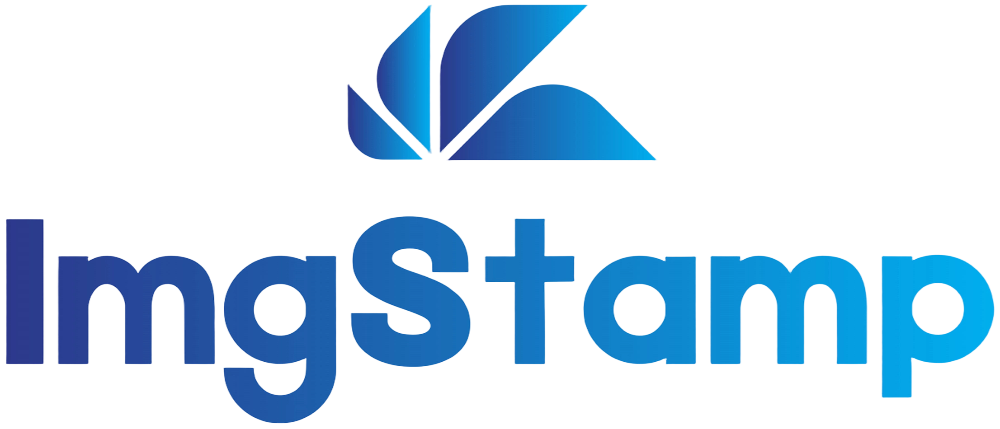

<p align="center">
  
</p>

<hr />

<p align="center">
  个人离线照片整理工具，批量加白边与文字标注并导出成品图
</p>

<p align="center">
  简体中文 | <a href="https://github.com/Lane0218/imgstamp/blob/main/README.en.md">English</a>
</p>

<p align="center">
  <a href="https://github.com/Lane0218/imgstamp/blob/main/LICENSE">
    
  </a>
  <a href="https://github.com/Lane0218/imgstamp/stargazers">
    
  </a>
  <a href="https://github.com/Lane0218/imgstamp/releases">
    
  </a>
  <a href="https://github.com/Lane0218/imgstamp/releases">
    
  </a>
  <a href="https://github.com/Lane0218/imgstamp">
    
  </a>
  <a href="https://github.com/Lane0218/imgstamp/commits/main">
    
  </a>
</p>

ImgStamp 是一款个人离线照片整理工具，用于批量添加白边与文字标注（日期 / 地点 / 描述），并导出风格统一的成品图。适合每年集中整理相册、从大量照片中筛选精华并进行统一排版。

## 功能特性

- 导入本地文件夹（JPG / PNG）并生成缩略图列表
- 选中与状态管理（待处理 / 信息完整 / 已导出）
- 自动读取 EXIF 日期，支持手动修改与批量填充
- 地点、描述输入与“缺省”标记
- 批量应用日期 / 地点 / 描述到多张照片
- 导出四种尺寸：五寸 / 大五寸 / 六寸 / 大六寸
- 项目保存 / 加载与自动保存

## 系统要求

- Windows 11（x86）

## 下载与安装

前往 GitHub Releases 下载并安装 `ImgStamp-Setup-*.exe`：
- `.blockmap` 与 `latest.yml` 为自动更新产物，无需手动下载

## 使用流程

1. 导入图片文件夹
2. 选择照片并完善日期 / 地点 / 描述
3. 选择导出尺寸并开始导出
4. 成品图输出到指定导出目录

## 注意事项

- 不修改原始图片，所有输出写入导出目录
- 暂不支持 HEIC，仅支持 JPG / PNG

## 开发与构建

本地编译运行：

```bash
npm install
npm run run
```

构建与打包：

```bash
npm run build
npm run dist
```

发布到 GitHub Release：

```bash
$env:GH_TOKEN="你的token"
npm run release
```

## 文档

- `docs/PRD.md` 产品需求
- `docs/TECH_DESIGN.md` 技术设计
- `docs/FEAT_DESIGN.md` 排版系统规范
- `docs/UI_DESIGN.md` UI 设计

## 贡献与反馈

欢迎提交 PR / Issue，也可以通过邮箱联系：`laneljc@qq.com`

## License

MIT License，详见 `LICENSE`。
